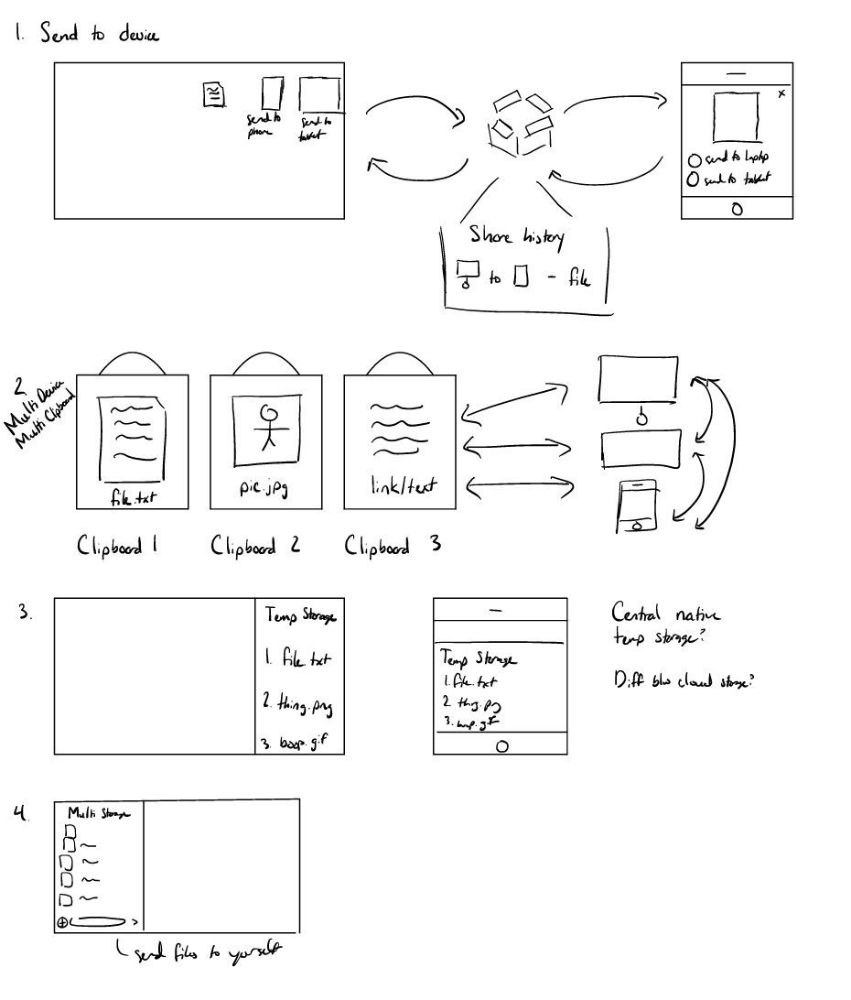
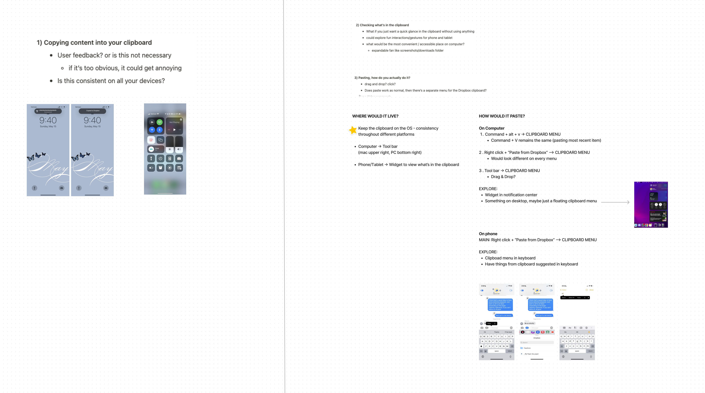
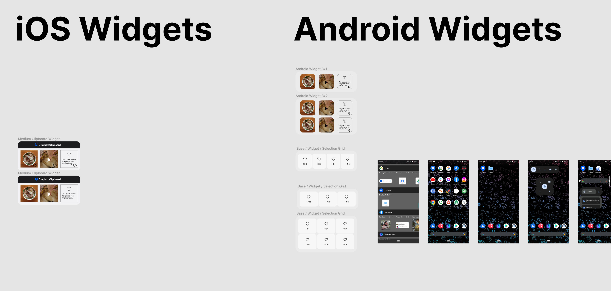

# Design
{:.no_toc}

## Table of contents
{: .no_toc .text-delta }

1. TOC
{:toc}

---

## Design Reflection

After concluding research on Gen-Z creative students’ workflows, we shifted into our final phases of our project: ideation and prototyping. As we started brainstorming from our original research, we prioritized and took interest in the fact that Gen-Z students wanted something fast, reliable, and easy to share their content with themselves. With this information, we hypothesized that the clipboard could be a potential solution for transferring files across devices. This feature already exists across operating systems, but we did not hear from many people in surveys or interviews on how they use their clipboard aside from the common “copy and paste” function. Therefore, before we shifted into our final phases of ideation we ran one final survey.

Insights from this survey informed our ideation and prototyping phases, allowing us to create Dropbox Clip, our final product for Dropbox. Dropbox Clip is a multi-device clipboard with an expanded capacity. It allows users to copy from one device and paste on the other, even across varying operating systems (e.g., copying on an iPhone (iOS), pasting on a Surface Pro (Windows)). The capabilities of Dropbox Clip are not overriding the system’s copy & paste, but expanding its abilities, allowing users to hold up to six items in Dropbox clip at once. Creating a visual way for users to look inside their clipboard, and all it takes is a simple click to recopy an item from the Clip menu which then allows users to paste as normal.

### Ideation

When we first set off to ideate a solution to our design question, it was very hard to create something that did not 
already exist. As an Apple user, tools such as AirDrop and Universal Clipboard already made it easy to transfer content 
between my devices (iPhone, iPad, and Macbook). Nevertheless, I tried to put myself in the shoes of the target user and 
imagine what could simplify the process.

All of my ideas centered around instant sharing between devices with Dropbox as the medium or expanded sharing capacity 
since our previous research indicated that these were things that users wanted. When the group came together for our 
ideation jam session, we saw that a lot of us had very similar ideas, which could be a bad or a good thing. When we
talked, we centered around the idea of the clipboard for transfer of ephemeral content — short-lived content such as 
screenshots. The clipboard inherently transfers content from one place to another using the copy and paste functionality.
We decided to launch a survey about to gather more information about content retrieval and transfer using the clipboard.

Once we got the survey results back, we were fairly confident that expanding on the clipboard could be the solution to 
our design question. Though, the details of what it entailed took several fairly long meetings to hammer out the details.
Each of these meetings focused on making sure that whatever we created connected back to our user research as well as be
something that other Gen-Zs would actually use.

### Prototyping

Because our idea was centered around supporting content transfer across different devices, we had to make sure that 
every platform for mobile, tablets, and computers had to be prototyped. This ended up creating a lot of mid-fi 
prototypes. I primarily focused on creating prototypes for devices and interactions that I was familiar with: iOS widgets,
iPad multitasking, and most of Android interactions.

In the grand scheme of things, I only had to prototype a small number of things as I started to shift focus to the video
of our final design since I was one of two people in the group who had made videos before. Yet, I still came back to 
help out others with their prototypes as they needed and I ended up doing a couple of animations in Figma so that 
everything could come together in a timely manner. Most notability, I spent the longest time getting the drag and drop
animation working so that it could be used in our video and user testing.

