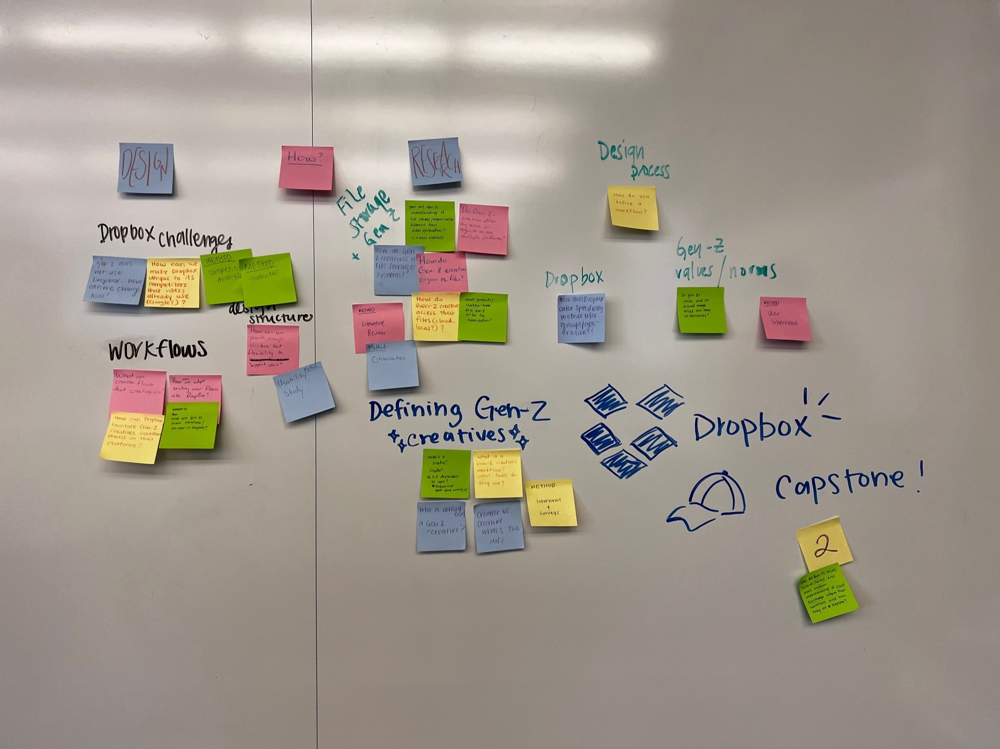
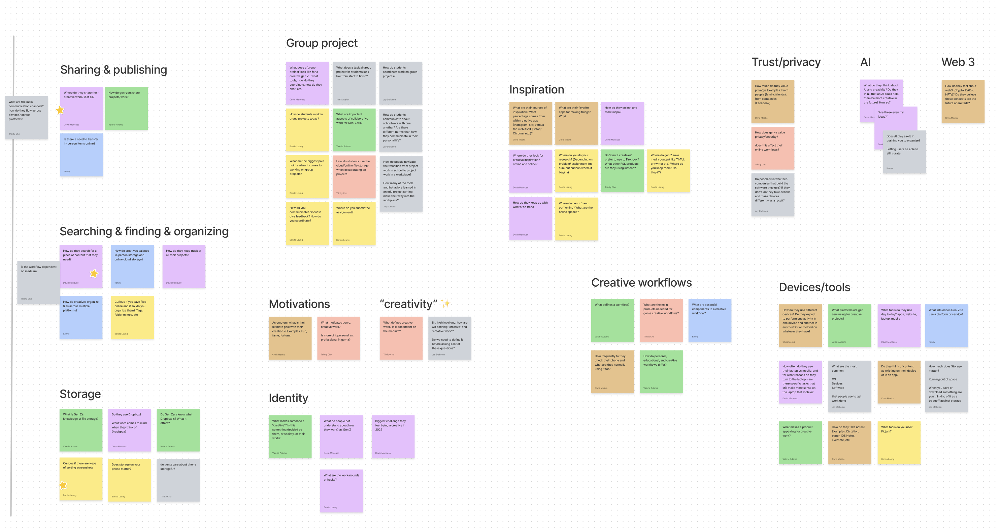

# Project Scoping
{:.no_toc}

## Table of contents
{: .no_toc .text-delta }

1. TOC
{:toc}
---

## Initial Scoping
When Dropbox first approached us with the capstone project, they were interested in finding out more about how Gen-Z
students collect, organize, and share content in their creative work. This in itself was a very broad field as Gen-Z
and file usage encompasses a large number of things that wouldn't be feasible to address in one capstone project. We 
started with some high level brainstorming of what things we wanted to investigate or find out about in relation to 
Gen-Z and files. 

However, after we went through and discussed our initial questions, we still didn't quite know what we wanted to address
with our capstone project. That's when we relied on our sponsor and a few of his team-members. We figured, instead of 
trying to figure out what the Dropbox Team wanted to address in the capstone project, we should instead work with them
to scope our questions down. With that in mind, we set up a design jam-session to help scope down the domain of our 
project.

## Design Session

The design session consisted of four rounds of brainstorming and affinity diagramming. Each round addressed different
sets of questions and were structured in a way to help us scope the domain of our project.

| Round | Question |
| ----- | -------- |
| 1     | What are we asking? (What do we need to know about the topic space? What questions about Gen Z creatives do you have?) |
| 2     | Who is Dropbox? (Main value proposition, user groups, domains, use cases)
| 3     | What defines a creative/creator? What jobs do they work in? What mediums? | 
| 4     | What are your main workflows as a creative? | 

During our meeting with the Dropbox Team, we came up with a number of ideas and questions for each round which gave us a 
broader sense of what we wanted to tackle but did not particularly help with scoping down the problem space. Each round
of the design session introduced new ideas that we could have focused on. 

After the design session, we felt that we were still at square one with what to focus on for the project. We were
particularly worried because at this point, we needed to start user research but our domain was so wide that it would
be hard to scope it down to just one particular research question. However, after one of our check-in meetings with our 
TA, she let us know that it's perfectly okay to have a broad domain for the research question; the research phase can
also be used to scope the domain into something that is worth looking into. With a new sense of relief, we then set off 
to structure our project for the rest of the quarter and begin the user research phase.
