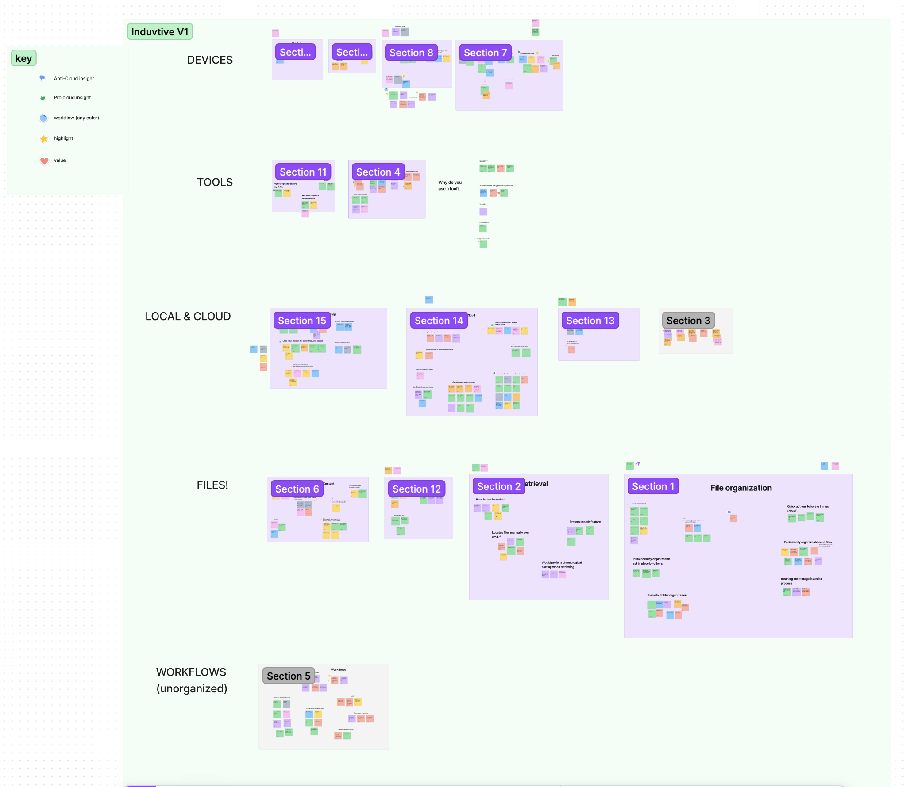

# User Research
{:.no_toc}

## Table of contents
{: .no_toc .text-delta }

1. TOC
{:toc}

---

## Overview

In today’s digital era, the idea of “files” and how we share them are being abstracted away from their original concept. Users now are forced to store and manage their content that exists both locally and on the web. As a result, the Design Strategy Team at Dropbox is looking to explore how Gen-Z creatives interact with technology. Due to the nuanced and complex nature of this topic, our team is seeking a better understanding of Gen-Z creatives and how they go about working on their creative projects in a digital space. To approach this, we started by asking:

**How do Gen-Z creatives collect, organize, retrieve, and use (CORU) content across different devices and surfaces\* when working on projects?**

CORU is a term defined from our sponsor, Dropbox, and we believe it accurately describes the common workflow process. “Devices” refers to laptops, mobile phones, etc. and “surfaces” includes local and browser interfaces.

## Research Reflection

User research spanned the most time in our timeline as the project ended up being a much more research-heavy project
than we had originally anticipated. Our research phase spanned several weeks and included both qualitative and 
quantitative research methods (surveys and interviews). We originally had intended to do a diary study as a part of our
research but we ran into a number of issues with it. When we had talked to the Master's Dropbox Capstone Team (who also
had done a diary study) to get some inspiration for our diary study, we were warned that it was like pulling teeth 
getting participants to be consistent with their responses. After we had launched our diary study, we ultimately had to
scrap it because we only got 2 completed diary studies back from the 5 participants that we recruited to do it. Nevertheless,
the user research phase revealed a number of insights that fueled our design phase.

While the user research had spanned the most time for our project, I did not have a huge role in it. Valerie, was the
project manager for the research phase and ended up doing most of the heavy-lifting as that was her domain. My role in
user research is described below:

### Survey

For the surveys, I helped push it out to different communities of people in order to ensure that our survey reached a 
broad depth of people. Once the surveys had wrapped up, I helped aggregate the data by question in order to pull out 
insights that fueled the interviews.

### Interviews

I was the primary person for the logistics behind the interviews: reaching out to interested individuals and scheduling 
interviews. In addition, I lead and transcribed 3 interviews as well as sit in and took notes for 2 other interviews,
across the 12 participants in our interview study. Once the interview study had concluded, we came together as a team
to conduct a thematic analysis to pull initial insights from the interviews.

### Insights Report

Once we had finalized the initial insights from survey and interviews, we were left to answer the question of *so what?*. 
The Dropbox Team explained to us that insights only mean so much but the *so what* is essentially what the researchers
are recommending the stakeholders do with the insights. As a team, we went back to our insights and quotes to use 
inductive reasoning and generalize the commonalities we saw. This at allowed us to get a view from everything at a high
level and from the *so what* points that tie together our research.  

The so what insights generally took a couple of rounds of iteration to get to their most polished version. When
we initially made our slide deck to present to the Dropbox Team, we put the bare minimum content on the slides and
the most important parts in our speaking part. It was interesting to see that the Dropbox Team wanted it the other way 
around since our team generally agreed that what we did was standard based on what we learned in HCDE. For the slide
deck, we each split the insights evenly among all of us so that we could get it reviewed and polished in a timely manner.